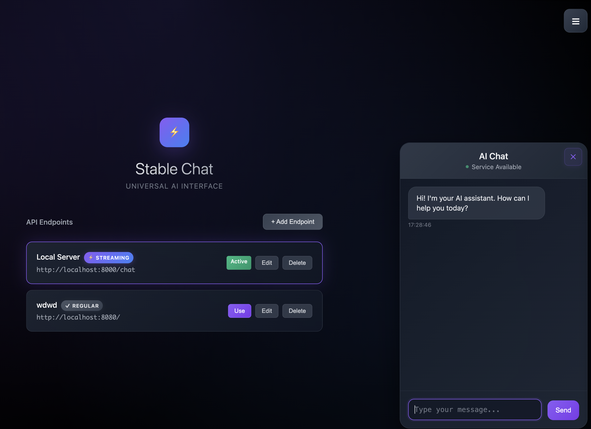

# Stable Chat UI

A modern, universal chat interface for connecting to any AI service via configurable API endpoints. Designed for easy local or remote AI chat integration, with a beautiful, responsive UI, voice input support, and comprehensive endpoint management.



## Features

- **Universal AI Interface**: Connect to any AI chat service with a compatible API
- **Voice Input Support**: Speech-to-text functionality using Web Speech API with auto-send capabilities
- **Configurable Endpoints**: Add, edit, and manage multiple API endpoints with JWT authentication support
- **Streaming Support**: Real-time streaming responses for compatible APIs with multiple format support
- **Markdown Rendering**: Rich text formatting in chat messages with syntax highlighting
- **Conversation Tracking**: Displays conversation IDs with floating chip design
- **Resizable Chat Window**: Customizable chat interface with drag resize functionality
- **Response Time Tracking**: Monitor endpoint performance with average response time metrics
- **Responsive Design**: Works on desktop and mobile devices with touch-optimized controls
- **Local Storage**: Configurations and conversations saved in browser storage
- **No Dependencies**: Built with vanilla JavaScript, no external libraries required

## Getting Started

### Installation

1. Clone the repository:
   ```bash
   git clone https://github.com/yourusername/stable-chat-ui.git
   cd stable-chat-ui
   ```

2. Serve the files using any HTTP server (HTTPS required for voice input):
   ```bash
   # Using Python
   python -m http.server 8080
   
   # Using Node.js (install globally first: npm install -g serve)
   serve -s . -l 8080
   
   # Using VS Code Live Server extension
   # Right-click index.html → "Open with Live Server"
   ```

3. Open your browser and navigate to `http://localhost:8080`

**Note**: For voice input functionality, HTTPS is required. Use a reverse proxy or deploy to a secure server for full voice feature access.

### Configuration

To use Stable Chat UI, you need to configure at least one API endpoint:

1. Click the "+ Add Endpoint" button
2. Enter a name for your endpoint (e.g., "GPT-4", "Claude", "Local Server")
3. Enter the URL of the API endpoint
4. Configure headers (typically including your API key)
5. Specify model name (optional, defaults to "custom-notset")
6. Select the HTTP method (usually POST)
7. Toggle streaming if your API supports it
8. Configure JWT authentication if required
9. Click Save

### Voice Input Setup

The voice input feature works automatically in supported browsers:

- **Supported Browsers**: Chrome, Edge (full support), Firefox (limited), Safari (partial)
- **Requirements**: HTTPS connection for microphone access
- **Usage**: Click the microphone button in the chat input area
- **Auto-send**: Voice messages ending with punctuation are automatically sent
- **Manual Control**: Click the microphone button again to stop recording

## API Compatibility

Stable Chat UI follows **DeepChat development standards** and is designed to work with various AI chat APIs. The application expects the following exact format for requests and responses:

### Request Format

```json
{
  "messages": {
    "role": "user",
    "text": "Your message here"
  },
  "model": "custom-notset",
  "thread_id": "optional-conversation-id",
  "stream": true
}
```

**Note**: The messages field now uses a single object instead of an array, and conversation tracking uses `thread_id` instead of `conversation_id`.

### Response Format

For regular (non-streaming) responses:

```json
{
  "text": "AI response text",
  "thread_id": "conversation-id"
}
```

For streaming responses, the application supports multiple formats:
- **Server-Sent Events (SSE)**: `data: {"content": "text", "type": "data"}`
- **Line-delimited JSON**: `{"content": "text", "type": "data"}`
- **Plain text streaming**: Direct text chunks
- **FastAPI SSE format**: `{"content": "text", "type": "text_sql"}` for formatted content

### CORS Configuration

For local development with backend APIs, ensure CORS is configured:

```python
# FastAPI example
from fastapi.middleware.cors import CORSMiddleware

app.add_middleware(
    CORSMiddleware,
    allow_origins=["http://localhost:8080"],  # Your UI port
    allow_credentials=True,
    allow_methods=["*"],
    allow_headers=["*"],
)
```

## Project Structure

The project is organized into modular JavaScript files:

- `app.js` - Main application entry point
- `js/StableChatApp.js` - Main application orchestrator
- `js/EndpointManager.js` - Manages API endpoints and their UI
- `js/ChatManager.js` - Handles chat functionality, API communication, and voice input
- `js/VoiceManager.js` - Speech-to-text functionality using Web Speech API
- `js/StorageManager.js` - Manages localStorage operations and response time tracking
- `js/MarkdownParser.js` - Handles markdown parsing and syntax highlighting
- `js/Utils.js` - Shared utility functions
- `js/MenuManager.js` - Manages the menu and documentation
- `index.html` - Main HTML structure with voice input controls
- `styles.css` - CSS styling with voice input and responsive design

## Customization

### Adding a Default Endpoint

You can modify the default endpoint in `js/StorageManager.js`:

```javascript
static getDefaultEndpoint() {
    return {
        id: 'default',
        name: 'Local Server',
        url: 'http://localhost:8000/chat',
        method: 'POST',
        headers: { 'Content-Type': 'application/json' },
        model: 'custom-notset',
        isDefault: true,
        isStreaming: false
    };
}
```

### Styling

The application uses CSS variables for theming. You can modify the colors and styles in `styles.css`.

## Troubleshooting

If you encounter issues:

- Check that your API endpoint URL is correct
- Verify your API key and headers
- Ensure your API service is running and accessible
- Check browser console for any errors
- Verify that your API follows the exact format (messages as object, thread_id for conversation tracking)
- Ensure your API returns `thread_id` in responses
- For streaming issues, verify your API supports the expected streaming format
- For voice input, ensure HTTPS and microphone permissions

### Common Issues

**CORS Errors**: Configure CORS headers on your backend or serve the UI from the same domain as your API.

**No Response**: Check browser console for errors, verify API response format matches the structure above with `thread_id` instead of `conversation_id`.

**Conversation ID Not Showing**: Ensure your API returns `thread_id` in the response. The ID will appear as a floating purple chip in the top-left corner of the chat.

**Voice Input Not Working**: 
- Ensure you're using HTTPS (required for microphone access)
- Check browser compatibility (Chrome/Edge recommended)
- Verify microphone permissions are granted
- Look for error messages in the voice status area

**Chat Window Resize Issues**: Use the resize handle in the bottom-right corner of the chat window. Resize constraints: 300-800px width, 400px-90vh height.

## Browser Compatibility

Stable Chat UI works with all modern browsers that support ES6 modules, including:

- **Chrome (latest)**: Full support including voice input
- **Edge (latest)**: Full support including voice input
- **Firefox (latest)**: Core features supported, limited voice input support
- **Safari (latest)**: Core features supported, partial voice input support

### Voice Input Compatibility
- **Full Support**: Chrome, Edge (webkitSpeechRecognition)
- **Limited Support**: Firefox (SpeechRecognition API)
- **Partial Support**: Safari (some versions)
- **Requirements**: HTTPS connection, microphone permissions

## License

This project is licensed under the MIT License - see the LICENSE file for details.

## Contributing

Contributions are welcome! Please feel free to submit a Pull Request.

1. Fork the repository
2. Create your feature branch (`git checkout -b feature/amazing-feature`)
3. Commit your changes (`git commit -m 'Add some amazing feature'`)
4. Push to the branch (`git push origin feature/amazing-feature`)
5. Open a Pull Request
